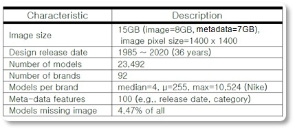
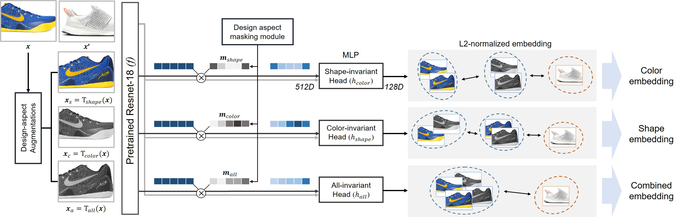
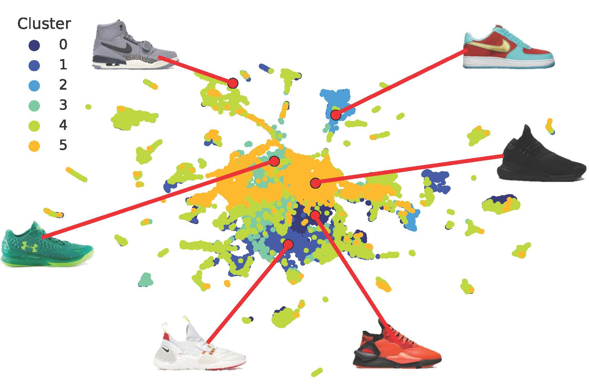
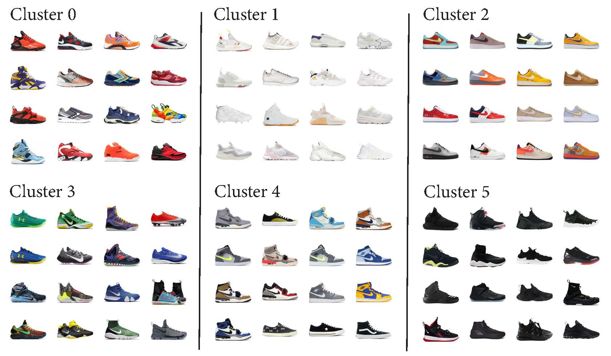
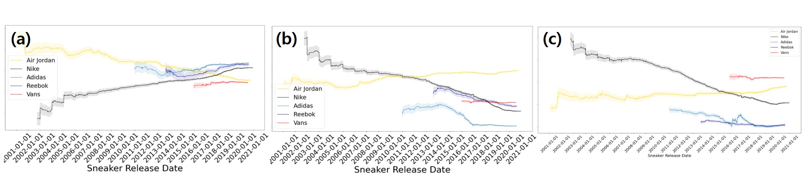

# The Sneakers Project

Hi there 👋 This repository is for the paper _"Using Web Data to Reveal 22-Year History of Sneaker Designs"_ submittted to **The Web Conference (WWW) 2022**.

### Data Description [(Data Link)](https://drive.google.com/drive/folders/1dYP4AFXGo_35-OS2yeRHeI4ZD_uFcPW_?usp=sharing)

#### 1. Overview
```
- We have crawled sneaker images and metadata from StockX, a leading online resale shop at global scale.
- Total number of sneaker products crawled: 23,492 (see Table 1 for basic statistics)
- Due to the copyright issue, we cannot provide the original sneaker images. Visit the link to find sneaker images: https://stockx.com/
- We share the data for our embedding results, SOTA embedding, and various engineered feature along with the crawled metadata.
- See Section 2 for the details of each dataset provided via the link.
```


Table 1. Basic statistics of the crawled data.

#### 2. Dataset Description
```
A. df_512_mask_shape_210927.csv:
- Color embedding: Constructed embedding for the latent shape-invariant representation (top module in Figure 1)
- Columns: 1) 0 ~ 511: 512 dimensional (D) embedding features; 2) 512: product ID; 3) 513 ~ 612: 100D metadata features

B. df_512_mask_color_210927.csv:
- Shape embedding: Constructed embedding for the latent color-invariant representation (middle module in Figure 1)
- Columns: 1) 0 ~ 511: 512D embedding features; 2) 512: product ID; 3) 513 ~ 612: 100D metadata features

C. df_512_mask_all_210927.csv:
- Combined embedding: Constructed embedding for the latent all-invariant representation (bottom module in Figure 1)
- Columns: 1) 0 ~ 511: 512D embedding features; 2) 512: product ID; 3) 513 ~ 612: 100D metadata features

D. df_384_looc.csv:
- Constructed embedding for the Leave-one-out Contrastive Learning (LooC)
- We consider this one as SOTA and compare our model with this one (Xiao et al, ICLR 2021)
- Columns: 1) 0 ~ 383: 384D embedding features; 2) 384: product ID; 3) 385 ~ 484: 100D metadata features

E. total_df_RGBHSV_ent_seg_rgbHistBin128_meta.pkl:
- Features from the feature engineering (see the manuscript for more detailed description)
- Columns: 1) 0: product ID; 2) 1 ~ 12: 12D color distribution parameters (mean, std) for RGB, HSV; 3) 13 ~ 19: 7D color entropy features for RGB, HSV, Grayscale; 4) 20 ~ 24: 5D image segmentation features; 5) 25 ~ 408: 384D color histogram of 128 bins for RGB; 6) 409 ~ 508: 100D metadata features

F. val_sneakers_df.pkl:
- Metadata crawled from StockX.com.
- Columns: 1) 0: pid (product ID), you can crawl the same sneaker images as we did by using this ID; 2) 1 ~ 100: a total of 100 metadata features including product name, retail price, colorway, release date, primary category, consumer type, and so on.
```


Figure 1. Illustration of the design embedding model.

#### 3. Code Description
```
A. sneaker_embedding_masked_three_heads.ipynb (see in embSneakers/code/ in the repository):
- Since sneaker images cannot be provided, you cannot construct embeddings from the given codes.
- Rather, please refer to the codes to understand how the embeddings are constructed in details.

B. classification_and_regression.ipynb (see in embSneakers/code/ in the repository):
- From the code, you can run classification and regression tasks by inputting the provided embedding datasets (three from our model, one from SOTA).
- Kinds of inference tasks: 1) Classifications for Primary Category (8 classes), Consumer Type (5 classes), and Maximum Resale Premium (2 classes); 2) Regression for Maximum Resale Premium
- Kinds of inference model: 1) Multinomial Logistic Regression; 2) XGBoost; 3) Multi-layered Perceptron (MLP, a Neural-net method)
```

#### 4. Additional Results

Below, we attach additional clustering results for the _combined embedding_, which were excluded from the manuscript due to page limit.


(a) K-means clustering result of the sneaker embedding for the combined attribute.
<br/><br/>


(b) Examples of sneaker products by cluster for the combined attribute.<br/>
Figure 2. Centroids within clusters and their 15-nearest neighbors based on the combined embedding.
<br/><br/>

Below, attached please find the temporal sneaker design patterns by major five brands based on the three constructed embeddings.


Figure 3. Temporal sneaker design patterns by brand via the embeddings. (a) Color embedding with one standard error shadows
(the index values on y-axis were normalized by min-max scaling); (b) Shape embedding; (c) Combined embedding.
<br/><br/>

We will disclose our contact information once the review period of WWW 2022 is ended.

<End of Document>


<!--
### **embSneakers/embSneakers** is a ✨ _special_ ✨ repository because its `README.md` (this file) appears on your GitHub profile.

Here are some ideas to get you started:

- 🔭 I’m currently working on ...
- 🌱 I’m currently learning ...
- 👯 I’m looking to collaborate on ...
- 🤔 I’m looking for help with ...
- 💬 Ask me about ...
- 📫 How to reach me: ...
- 😄 Pronouns: ...
- ⚡ Fun fact: ...
-->
