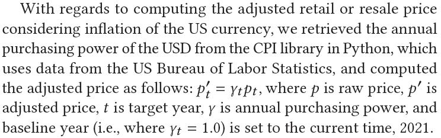
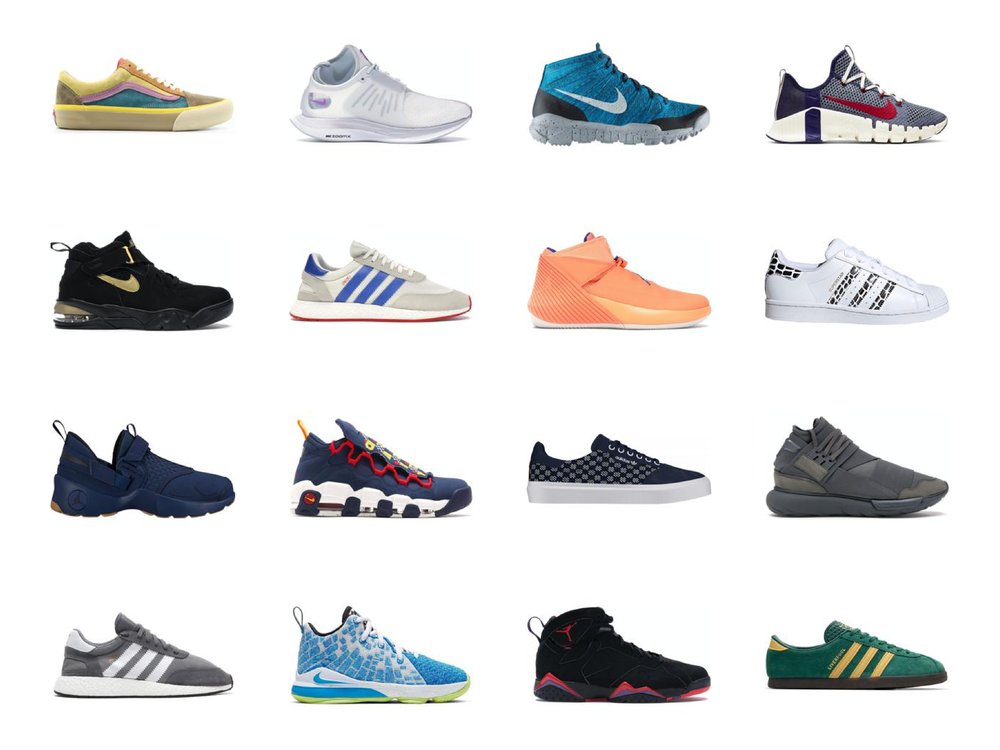

# The Sneakers Project

Hi there 👋 This repository is for the [paper](https://drive.google.com/file/d/1nLAVImXQAsyM9DEW5IjGD3sWGpeO_CjZ/view) _"Using Web Data to Reveal 22-Year History of Sneaker Designs"_ ACCEPTED to **ACM The Web Conference (WWW) 2022**. <br>
[News] This paper was one of the **BEST PAPER CANDIDATES** (**top 3.41%** among the accepted papers)!

[Please cite as]
Park S, Song H, Han S, Weldegebriel B, Manovich L, Arielli E, Cha M. Using Web Data to Reveal 22-Year History of Sneaker Designs. In proc. of The Web Conference 2022 (WWW), 2022. doi:10.1145/3485447.3512017.

### Data Description [(Data Link)](https://bit.ly/3DvnC6p)

#### 1. Overview
```
- We have crawled sneaker images and metadata from StockX (https://stockx.com/), a leading online resale shop at global scale.
- Total number of sneaker products crawled: 23,492 (see Table 1 for basic statistics).
- Due to the copyright issue, we cannot provide the original sneaker images directly; instead, we share downloadable links as metadata.
- We share the data for 1) our embedding results, 2) SOTA embedding, and 3) various engineered features along with 4) the crawled metadata containing image downloadable links and 5) the entire history of resale transactions for the sample sneaker products from 2012 to 2020.
- See Section 2 for the details of each dataset provided via the link.
- See Section 3 for the details of the codes to reproduce the research outcomes.
- See section 4 for additional results not shown in the paper due to page limitations.
```


Table 1. Basic statistics of the crawled data.

#### 2. Dataset Description
```
A. df_512_mask_shape_210927.csv (259.8MB):
- Color embedding: Constructed embedding for the latent shape-invariant representation (top module in Figure 1).
- Columns: 1) 0 ~ 511: 512 dimensional (D) embedding features; 2) 512: product ID; 3) 513 ~ 612: 100D metadata features.

B. df_512_mask_color_210927.csv (261.2MB):
- Shape embedding: Constructed embedding for the latent color-invariant representation (middle module in Figure 1).
- Columns: 1) 0 ~ 511: 512D embedding features; 2) 512: product ID; 3) 513 ~ 612: 100D metadata features.

C. df_512_mask_all_210927.csv (260.5MB):
- Combined embedding: Constructed embedding for the latent all-invariant representation (bottom module in Figure 1).
- Columns: 1) 0 ~ 511: 512D embedding features; 2) 512: product ID; 3) 513 ~ 612: 100D metadata features.

D. df_384_looc.csv (211.9MB):
- Constructed embedding for the Leave-one-out Contrastive Learning (LooC).
- We consider this one as SOTA and compare our model with this one (Xiao et al, ICLR 2021).
- Columns: 1) 0 ~ 383: 384D embedding features; 2) 384: product ID; 3) 385 ~ 484: 100D metadata features.

E. total_df_RGBHSV_ent_seg_rgbHistBin128_meta.pkl (108.6MB):
- Features from the feature engineering (see the manuscript for more detailed description).
- Columns: 1) 0: product ID; 2) 1 ~ 12: 12D color distribution parameters (mean, std) for RGB, HSV; 3) 13 ~ 19: 7D color entropy features for RGB, HSV, Grayscale; 4) 20 ~ 24: 5D image segmentation features; 5) 25 ~ 408: 384D color histogram of 128 bins for RGB; 6) 409 ~ 508: 100D metadata features.

F. val_sneakers_df.pkl (42.8MB):
- Metadata crawled from StockX.com.
- We share downloadable links ("imageUrl") for the sneaker image samples of the current study: see "crawling_source.ipynb" to download the images via the links.
- Columns: 1) 0: pid (product ID), images can be distinguished by this ID; 2) 1 ~ 100: a total of 100 metadata features, e.g., product name, retail price, colorway, release date, primary category, consumer type, and so on; 3) 101: imageUrl, downloadable links for the target sneaker images.

G. resale_transactions_ALL.csv (1.68GB):
- Containing ALL resale transactions for the target sneaker products, from 2012Q2 to 2020Q3.
- Columns: 1) quarter_sold; 2) month_sold; 3) original_resalePrice; 4) inflated_resalePrice: we compute adjusted (inflated) retail or resale price by following the process described in Figure 2; 5) original_retailPrice; 6) inflated_retailPrice; 7) original_profit; 8) inflated_profit, 9) date_of_release: sneaker release date; 10) image_fileName: pid.
```


Figure 1. Illustration of the design embedding model.

<br>
<br>


Figure 2. Description of the computing process of adjusted retail or resale price.

#### 3. Code Description
```
A. crawling_source.ipynb (see in embSneakers/code/ in the repository):
- From the code, you can automatically download the sneaker images that have been sampled for the current work, via the links from the metadata: see the last column "imageUrl" in "val_sneakers_df.pkl."
- i.e., One image per sneaker product is downloaded and used in the current study.
- You only need to run "Crawling by imageUrl" part if you properly download "val_sneakers_df.pkl"; "RAW Crawling source (Using Selenium, Chromdriver)" part is used only when crawling from the scratch.

B. sneaker_embedding_masked_three_heads.ipynb (see in embSneakers/code/ in the repository):
- You need to download the sneaker image samples from A. first to construct embeddings from the given code.
- Otherwise, please refer to the code to understand how the embeddings are constructed in details.

C. classification_and_regression.ipynb (see in embSneakers/code/ in the repository):
- From the code, you can run classification and regression tasks by inputting the provided embedding datasets (three from our model, one from SOTA).
- Kinds of inference tasks: 1) Classifications for Primary Category (8 classes), Consumer Type (5 classes), and Maximum Resale Premium (2 classes); 2) Regression for Maximum Resale Premium.
- Kinds of inference model: 1) Multinomial Logistic Regression; 2) XGBoost; 3) Multi-layered Perceptron (MLP, a Neural-net method).
```

#### 4. Additional Results

Below, we attach additional clustering results for the _combined embedding_, which were excluded from the manuscript due to page limit.


(a) K-means clustering result of the sneaker embedding for the combined attribute.
<br/><br/>


(b) Examples of sneaker products by cluster for the combined attribute.<br/>
Figure 3. Centroids within clusters and their 15-nearest neighbors based on the combined embedding.
<br/><br/>

Below, attached please find the temporal sneaker design patterns by major five brands based on the three constructed embeddings.


Figure 4. Temporal sneaker design patterns by brand via the embeddings. (a) Color embedding with one standard error shadows
(the index values on y-axis were normalized by min-max scaling); (b) Shape embedding; (c) Combined embedding.
<br/><br/>

Regarding the temporal sneaker design patterns for the color and shape embeddings (Figure 4(a) and (b)), we sampled a total of 16 sneaker images (top left is the mean value and the rest are the closest 15 neighbors) for three bins, respectively, as shown in Figure 5. The bins are high, mid, and low, respectively, where they are binned based on the Sneaker Design Index values.

 &nbsp; &nbsp;  &nbsp; &nbsp; <br>
(a) Three bins (from left to right, high, mid, and low, respectively) for the color embedding.<br>
 &nbsp; &nbsp;  &nbsp; &nbsp; <br>
(b) Three bins (from left to right, high, mid, and low, respectively) for the shape embedding.<br>
Figure 5. 16 sample sneaker images for each Sneaker Design Index bin for the color and shape embeddings.<br><br>

#### 5. Accepted for an award of AI × ART Contest 2021

"The sneakers universe" was accepted for the third prize of 'AI × ART Contest 2021' held by The National Science Museum in South Korea.


Figure 6. "the sneakers universe." Berhane Weldegebriel, Sungkyu (Shaun) Park, Sungwon Han, Lev Manovich, and Meeyoung Cha.
<br/><br/>

A work created using artificial intelligence by the Data Science Group in IBS was selected in the 'Artificial Intelligence and Art (AI × ART) 2021' contest. The National Science Museum in South Korea selected and announced 16 winners of the AI × ART contest on 17 December 2021. The National Science Museum held this contest to expand and popularize the AI creative field. A total of 130 works, including paintings, music, and media art, were submitted, and 8 students and 9 general candidates were selected as finalists.

The data science group team, led by Senior Researcher Sungkyu (Shanu) Park, submitted and won the prize, "The sneakers universe," a work that shows the evolution of sneakers at a glance. From StockX.com, the world's No. 1 sneaker resell platform, the team analyzed images of 23,492 pairs of sneakers sold from 1999 to 2020. Design information was extracted using contrastive learning, one of the recent deep learning technologies, and the extracted information was arranged in a two-dimensional space to depict the evolution of sneakers.

Senior Researcher Park said, "In the past, achromatic colors were predominant because sneakers were viewed as a simple means of walking, but over time, the colors of sneakers have changed. Through the color change of sneakers over the past 20 years in the work, we can see the social change in which individuals freely express their individuality and popular culture is diversified." <br>

Should you have any questions or comments, please contact us at the following email address: shaun01.park@gmail.com.<br>

<End of Document>


<!--
### **embSneakers/embSneakers** is a ✨ _special_ ✨ repository because its `README.md` (this file) appears on your GitHub profile.

Here are some ideas to get you started:

- 🔭 I’m currently working on ...
- 🌱 I’m currently learning ...
- 👯 I’m looking to collaborate on ...
- 🤔 I’m looking for help with ...
- 💬 Ask me about ...
- 📫 How to reach me: ...
- 😄 Pronouns: ...
- ⚡ Fun fact: ...
-->
